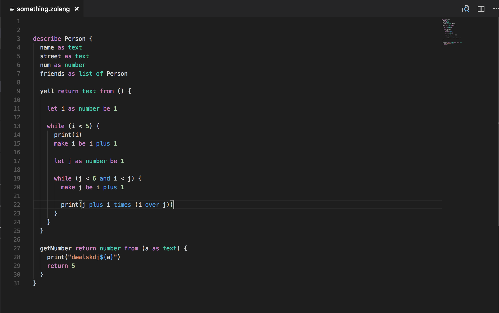

  <a href="https://github.com/Zolang/Zolang">Zolang</a> &bull;
    <a href="https://github.com/Zolang/ZolangTemplates">ZolangTemplates</a>
  <b> ZolangIDE </b>

# ZolangIDE (zolang-ide)

Visual Studio Code support for the Zolang programming language

## Screenshots

## Requirements

## Extension Settings

## Known Issues

## Release Notes

Users appreciate release notes as you update your extension.

### 0.0.1

Initial release

### 0.0.2

Minor fixes
